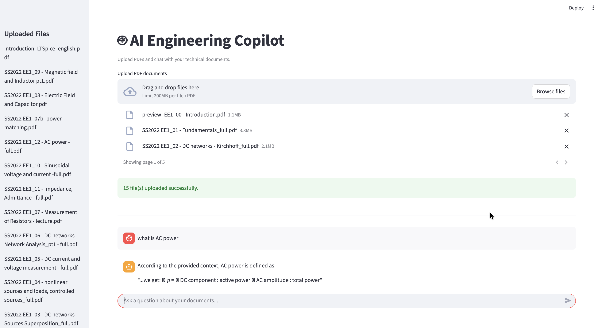
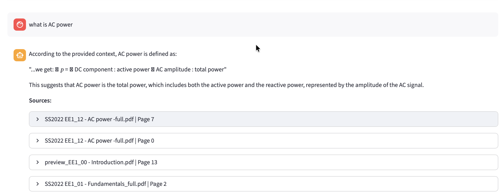
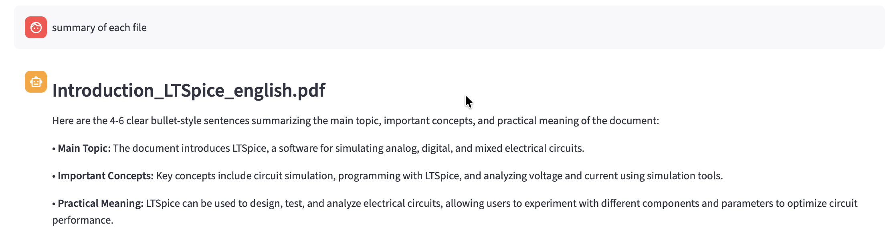
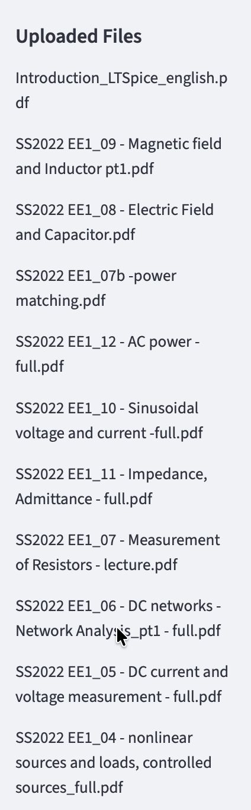

<div align="center">

# AI Engineering Copilot

**RAG · Local LLM · Semantic Search · Query Routing · Streamlit**

[](https://python.org)
[](https://langchain.com)
[](https://ollama.com)
[](https://faiss.ai)
[](https://streamlit.io)

</div>

---

## Overview

A **RAG-powered AI assistant** designed for engineering and technical document Q&A. Load PDF documents, ask questions in natural language, and get accurate, source-traced answers — all running **fully locally** with no API keys or cloud dependencies.

Built with LangChain, FAISS vector search, HuggingFace embeddings, and Ollama local LLM inference, with a clean **Streamlit web UI**.

---

## How It Works

```
PDF Documents
      │
      ▼
  Document Loading & Chunking
  (PyPDF · RecursiveCharacterTextSplitter)
      │
      ▼
  Vector Embeddings
  (sentence-transformers/all-MiniLM-L6-v2)
      │
      ▼
  FAISS Vector Store
      │
      ▼
  Query Router ──► list_files / summarize_all / qa
      │
      ├── Q&A ──► Similarity Search → Context → Ollama LLM → Streamed Answer + Sources
      │
      └── Summarize ──► Per-file summarization via LLM
```

---

## Features

| Feature | Detail |
|---|---|
| **Multi-PDF support** | Load and query across multiple documents simultaneously |
| **Semantic search** | FAISS similarity search with top-K chunk retrieval |
| **Query routing** | Automatically detects intent — Q&A, file listing, or summarization |
| **Streaming answers** | LLM responses streamed token-by-token in real time |
| **Source tracing** | Every answer cites the source file and page number |
| **Per-file summaries** | Summarize individual documents with a single query |
| **Local inference** | Fully offline — no OpenAI API or cloud calls |

---

## Project Structure

```
ai-engineering-copilot/
│
├── config.py              # Model config, paths, chunking parameters
├── prompts.py             # LLM prompt templates
│
├── src/
│   ├── loader.py          # PDF loading & metadata tagging
│   ├── splitter.py        # Text chunking
│   ├── embeddings.py      # HuggingFace embedding model
│   ├── vectordb.py        # FAISS vector store build & load
│   ├── retriever.py       # Similarity search & context builder
│   ├── router.py          # Query intent detection (Q&A / list / summarize)
│   ├── summarizer.py      # Per-file summarization logic
│   └── llm.py             # Ollama LLM interface & streaming
│
├── data/                  # Place your PDF files here
├── assests/               # UI screenshots
└── requirements.txt
```

---

## Configuration

Edit `config.py` to adjust key parameters:

```python
EMBEDDING_MODEL = "sentence-transformers/all-MiniLM-L6-v2"
LLM_MODEL       = "llama3.2"
CHUNK_SIZE      = 800
CHUNK_OVERLAP   = 150
TOP_K           = 4
```

---

## Setup & Run

**Prerequisites:** Python 3.8+, [Ollama](https://ollama.com/download) installed

```bash
# Clone the repository
git clone https://github.com/MM-Robin/ai-engineering-copilot
cd ai-engineering-copilot

# Create and activate virtual environment
python3 -m venv venv
source venv/bin/activate       # Windows: venv\Scripts\activate

# Install dependencies
pip install -r requirements.txt

# Pull the local LLM
ollama pull llama3.2

# Add your PDFs to the data/ folder, then launch
streamlit run app.py
```

---

## Screenshots

| Web UI | Q&A with Sources |
|---|---|
|  |  |

| Summary Response | Uploaded Files |
|---|---|
|  |  |

---

## Tech Stack

| Component | Technology |
|---|---|
| Framework | LangChain |
| Embeddings | HuggingFace `all-MiniLM-L6-v2` |
| Vector Store | FAISS |
| LLM | Ollama (Llama 3.2 — local) |
| UI | Streamlit |
| PDF Parsing | PyPDF |

---

## Author

<div align="center">

**Mainuddin Monsur Robin**
*M.Sc. Information and Communication Engineering — HAW Hamburg*

[](https://github.com/MM-Robin)

</div>
